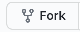
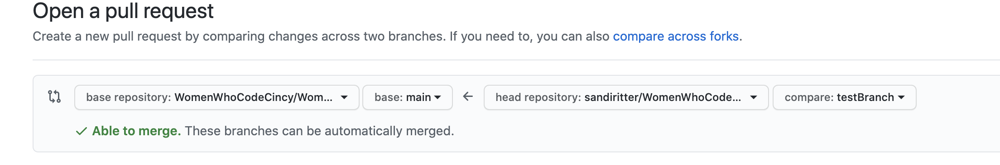
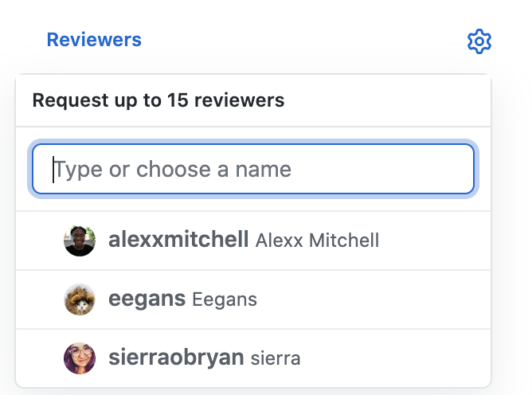

<p align="center">
  <a href="https://womenwhocodecincy.github.io/">
    
  </a>
</p>
<h1 align="center">
  Women Who Code Cincinnati
</h1>

Welcome to the Cincinnati Women Who Code starter flutter app repository, a Flutter project that showcases members and shares resources. Collaboration is welcome and encouraged!

[Quick start guide to contributing](https://github.com/WomenWhoCodeCincy/flutter-starter-app#-quick-start-guide-to-contributing)  
[Installing Flutter](https://github.com/WomenWhoCodeCincy/flutter-starter-app#installing-flutter)   
[Flutter Links](https://github.com/WomenWhoCodeCincy/flutter-starter-app#getting-started) 

## 🚀 Quick start guide to contributing

1. **Locate an issue that needs work**

    Navigate to the [issues tab](https://github.com/WomenWhoCodeCincy/flutter-starter-app/issues) and review the list of open issues.
    When ready to work an issue, place a comment on the issue so others know it is being worked by you.  And PLEASE only comment if you plan to work the issue immediately. 

2.  **Fork the repository**

     In the upper right-hand corner, click on  to fork this repo to your github account.

3. **Clone the repository**

    Navigate to your github account and locate the newly forked flutter-starter-app repo.
    Click the  button and copy the url.
    Using the command line or your favorite method of interacting with git, clone the repo
    ```shell
      git clone pasteInTheRepoNameHere
      ```
    
      Change directory into the root of the repo 
      ```shell
      cd flutter-starter-app
      ```
4.  **Create a branch**

    Create a new branch off of the main branch. Please name the branch in a manner that is indicative of the issue being resolved.
    ```shell
    git checkout -b myNewBranchName
    ```

5.  **Open the source code and start editing!**
   
    Open the `flutter-starter-app` directory in your code editor of choice and start working!!!

6. **Create a pull request**

    Once your changes have been completed and tested, push your branch to your repo. In github, navigate to the fork you created of the flutter-starter-app repo.       Click on Pull Requests in the main menu and select New Pull Request. Under the Compare Changes title, click on compare across forks. This will pre-populate the repos and branches to be merged. Verify that the head repo is your forked repo and the branch is your branch. Verify that the base repo is the flutter-starter-app repo and the branch is main.
   
  Click create pull request. The Open Pull Request page will appear which includes the pull request template for the base repo. Please complete the template and click Create Pull Request.
  On the right hand side of the screen, click on reviewers and select Sierra OBryan
  
  You are now done and your pull request will be code reviewed. You will be notified regarding any feedback and when it has been approved.

## Installing Flutter

### Helpful tips and tricks to get ready to contibute to our flutter project.

While the official [Flutter installation guide](https://flutter.dev/docs/get-started/install) technically has everything you need, here are some more explicit directions and troubleshooting to make it as easy as possible. 

Some assumptions I'm making: that you have git installed and understanding cloning. Not the case? That's okay - check out this [beginner friendly tutorial](https://youtu.be/ZRrzSAz9uOo) from our meeting last month to get started. 

A couple helpful hints before we get started: it would be helpful to put everything in one place. I have one "Development" folder where all these things (and my other projects live). If you're excited to build more things, it might be helpful to make your own "Development" folder to keep all your git repos in one place. If you're not sure yet, I would recommend making a "WWCode" folder to hold everything we do here (and maybe our [Gatsby site](https://github.com/WomenWhoCodeCincy/WomenWhoCodeCincy.github.io) and our [database](https://github.com/WomenWhoCodeCincy/wwcode-cincy-database)). 

1. **Install Android Studio 4.1 (or use IntelliJ)** 

    You might notice this is a different step one than the install guide but bare with me. 

    Two major reasons we're using Android Studio (or IntelliJ): these tools are available on all operating systems so we can all be looking at the same thing AND I use them regularly and so I can help troubleshoot if you run into problem. 

    Download Android Studio [here](https://developer.android.com/studio).  

    This is a doozey of a step and will take some time. It might be useful to have it done before the event so you can clone the project and have it opened to follow along but not eveyrone learns that way. It's totally okay if you have not downloaded it before the event - we'll offer a quick reminder to start the process when we kick off but you can also just hang out and watch and do it later in your own free time. 

    *IntelliJ also has Flutter and Dart support so if you already have IntelliJ and would prefer to use that you can skip this step. 

    In addition to Android Studio and IntelliJ, you can also use VSCode to write and edit Flutter (and I know people who do and prefer it!). If you're familiar with VSCode and it would make you more comfortable to use that instead, feel free. As a disclaimer, I do not use VSCode (for anything, often) so (again) I might struggle to help troubleshoot if you run into problems but Google can probably help us work through it! 

    You can also download Xcode if you're interested in running it on an iPhone but spoiler: this is also a long process so prepare yourself. It will not be used on Saturday! 

2.  **Start Android Studio and go through the Setup Wizard.**

    This installs the latest Android SDK, Android SDK Command-line Tools, and Android SDK Build-Tools, which are required by Flutter when developing for Android. (:

3. **Open your Terminal** 

    Okay so the reason that we installed AS first is that now we can all use the same terminal - AS has a terminal built into the IDE (so does IntelliJ) and Flutter installation requires a terminal. 

    Where to find your terminal - along the bottom of the IDE you should see some tabs and one should be terminal. If it's not there, you can also add it by going View -> Tool Window -> Terminal. 

    PS - you may need to open a project to make the full IDE open. AS is still an IDE so you can open something as simple as a txt file and be good to go. 

4. **Actual Flutter things**
    Now we can jump back to the start of the installation guide. 

    So now we're in our terminal and specifically we want to be in our "Development" directory or "WWCode" depending on how you named your folder.
 
    To navigate in the terminal, you can use `cd`...
    - to go up one folder use `cd ..`
    - to go into a folder use `cd FolderName/` (tab will help you autofill names as well).  
    - to see where you are in your folder system use `pwd`

    In "Development", we want to clone flutter so run the command: 
    `git clone https://github.com/flutter/flutter.git -b stable`

    Then you can add flutter to your path so that you can use flutter commands:   
    ```export PATH="$PATH:`pwd`/flutter/bin"```   
    ^^ This will only set your PATH variable for the current terminal window. You can also permanently add Flutter to your path following the [macOS directions](https://flutter.dev/docs/get-started/install/macos#update-your-path) or [windows directions](https://flutter.dev/docs/get-started/install/windows#update-your-path) or the other [install directions](https://flutter.dev/docs/get-started/install). 

    Now (still in your current terminal), run `flutter doctor` - two important things should happen 
    - one, it should work and you should see output (and NOT something about command not recognized)
    - two, you should see some errors because we haven't finished 

Example: 
```
sierra@atomicrobotsMBP ~ % flutter doctor
Doctor summary (to see all details, run flutter doctor -v):
[✓] Flutter (Channel stable, 1.22.1, on Mac OS X 10.15.6 19G73, locale en-US)
 
[✓] Android toolchain - develop for Android devices (Android SDK version 30.0.1)
[✓] Xcode - develop for iOS and macOS (Xcode 11.6)
[✓] Android Studio (version 4.0)
[✓] Android Studio (version 3.5)
[!] IntelliJ IDEA Ultimate Edition (version 2020.2.1)
    ✗ Flutter plugin not installed; this adds Flutter specific functionality.
    ✗ Dart plugin not installed; this adds Dart specific functionality.
[!] VS Code (version 1.49.0)
    ✗ Flutter extension not installed; install from
      https://marketplace.visualstudio.com/items?itemName=Dart-Code.flutter
[✓] Connected device (1 available)

! Doctor found issues in 2 categories.
```

   Better install some plugins then.. 

5. **Add Plugins**
    You'll need to install the Flutter and Dart Plugins to Android Studio (or IntelliJ). 
    How to do this from the menu bar: 
    Android Studio -> Preferences -> Plugins -> Marketplace -> search for and install Dart and Flutter (After the installation, you should be prompted to restart AS). 

    Boom you're done - Android Studio is set up and ready for some Flutter development! 

    Where's my Dart SDK?  
    `/Path/to/Maybe/Development/flutter/bin/cache/dart-sdk`   
    Where you'll need to replace the beginning of the path with where you actually cloned Flutter. 

    Reminder: you can check out your current path by running `pwd` (present working directory) in your terminal.

    Side note - I learned today that flutter doctor might not actually reflect that these plugins were installed. It checks a very specific regex pattern for where it expects things to be and if anything is askew, it will continue to give warnings. If Flutter and Dart are marked installed in AS, you can ignore flutter doctor plugin warnings! 

    It also might yell at you because you haven't installed / set up xcode but ¯\_(ツ)_/¯ we don't need it for this. 

6. **It might be helpful to create an Emulator to run this on**

    You can definitely build it on your phone if you're comfortable putting your Android device in developer mode. To install to an iPhone, you'll need xcode installed and set up AND an apple developer account to install to a physical device (I think). 

    To make a new emulator, you'll need to open your AVD (Android Virtual Device) Manager - this is an icon along the top that looks like an outline of a phone with a little android logo at the bottom. Then `+ Create Virtual Device...`. It will walk you through the steps of everything you need to download to make a new device - you'll have to pick a phone (I usually pick a Pixel) and then select a system image (API 30 is the latest - you'll probably have to download this first) and then you can name and create it. Now you'll be able to run the app on your new virtual device!   

**Final notes**
I recommend putting all of your projects for this event in the same folder - whether that be your development folder or something you made just for today! So when it comes time to fork the flutter app, run the command from the same directory where you cloned flutter. 

Many thanks to [Erica](https://github.com/librairica) for helping me find pain points to setting up Flutter from scratch! 

## Getting Started

This project is a starting point for a Flutter application.

A few resources to get you started if this is your first Flutter project:

- [Lab: Write your first Flutter app](https://flutter.dev/docs/get-started/codelab)
- [Cookbook: Useful Flutter samples](https://flutter.dev/docs/cookbook)

For help getting started with Flutter, view our
[online documentation](https://flutter.dev/docs), which offers tutorials,
samples, guidance on mobile development, and a full API reference.


